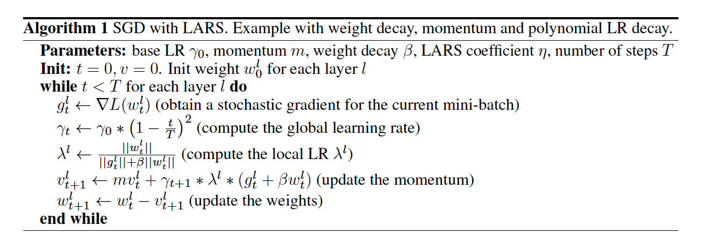

# [Large Batch Training of Convolutional Networks](https://arxiv.org/abs/1708.03888)

## Background

- Increasing the global batch while keeping the same number of epochs means that you have fewer
iterations to update weights.

    - The straight-forward way to compensate for a smaller number of iterations is to do larger steps by increasing the learning rate (LR).

    - using a larger LR makes optimization more
difficult, and networks may diverge especially during the initial phase.

    - "learning rate warm-up

- apply linear scaling and warm-up scheme to train Alexnet on Imagenet
- *BUT* scaling stopped after B=2K since training diverged for large LRs.

    |batch size| accuracy|
    |---|---|
    |base (256)|57.6%|
    |4K|53.1%|
    |8K|44.8%|

- To fix this:
    - replace Local Response Normalization with Batch Normalization (BN) --> AlexNet-BN
    - BN improves model convergence for large LR
    - for B=8K the accuracy gap was decreased from 14% to 2.2%.

## Motivation

- propose a way to analyze the training stability with large LRs: **measure the ratio between the norm of the layer weights and norm of gradients update**

- if this ratio is:
    -  too high, the training may become unstable
    -  too small, then weights don’t change fast enough

- This ratio varies a lot between different layers, which makes it necessary to use a separate LR for each layer.
- Propose LARS, two notable differences:
    1. uses a separate learning rate for each layer and not for each weight, which leads to better stability
    1. the magnitude of the update is controlled with respect to the weight norm for better control of training speed.

- With LARS, Alexnet-BN and Resnet-50 trained with B=32K without accuracy loss.

## LARS

The LARS algorithm.

## Some key points

- **LR warm-up**: training starts with small LR, and then LR is gradually increased to
the target.
- BN makes it possible to use larger learning rates.
- When $\lambda$ is large, the
update $\lVert \lambda * \nabla L(\omega_t)\rVert$can become larger than $\omega$, and this can cause the divergence. This makes the initial phase of training highly sensitive to the weight initialization and to initial LR.
- The paper found that the ratio the L2-norm of weights and gradients $\lVert \omega \rVert/\lVert \nabla L(\omega) \rVert$  varies significantly between weights and biases, and between different layers.
- The ratio is high during the initial phase, and it is rapidly decrease after few epochs.

