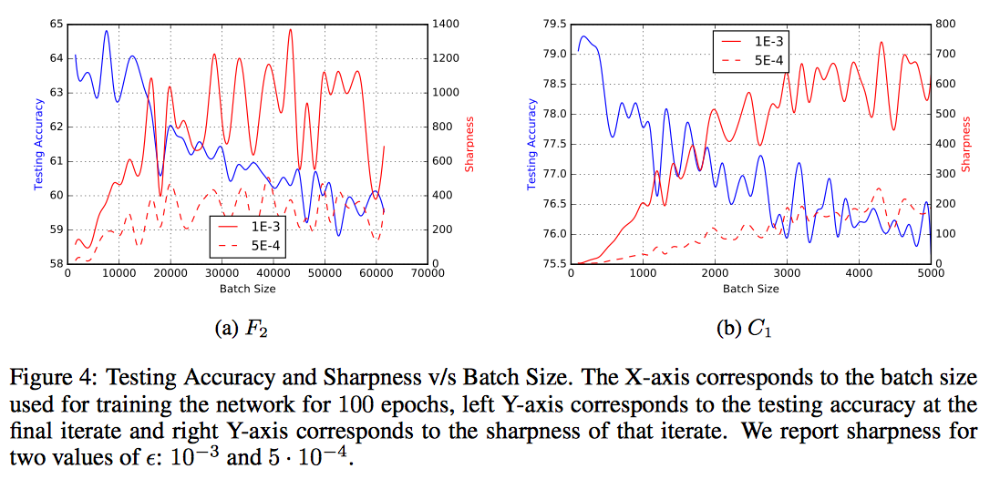
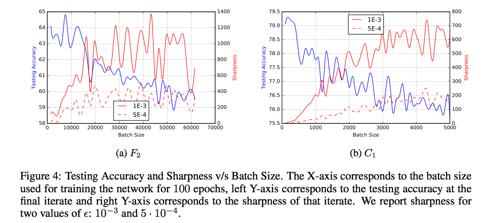

# [On large-batch training for deep learning: Generalization gap and sharp minima](https://arxiv.org/pdf/1609.04836.pdf)

## Exsiting problems

1. large batch methods over-fit the model.
1. large batch methods are attracted to saddle points.
1. large batch methods tend to zeeom-in on the mimimzer closest to the initial point.
1. small batch and large batch methods converge to qualitatively different minimizers with different properties.

## Conclusions/Founding in this parper

- The generalization gap is not due to over-fitting or over-training.  
- Due to the _**inherent noise**_ in the gradient estimation:

  - large-batch methods tend to converge to sharp minimizers of the training and testing fucntions.
    - the sharp minimizers are characterized by _**a significant number of large positive eigenvalues**_ in $\bigtriangledown^2f(x)$.
    - sharp minimizers tend to generalize well.
  - small-batch methods consistently converge to flat minimizers.
    - flat minimizers charaterized by _**having numerous small eigenvalues of $\bigtriangledown^2f(x)$**_.
- The loss function landscape of deep neural networks is such that large-batch methods are attracted to region with sharp minimizers and are unable to escape basins of attraction of these minimizers.
- **using a large-batch method that is warm-start with a small-batch method**.

## Some background information

- What is a flat minimizer and a sharp minimizer?
  - **flat minimizer $\mathbf{x}^*$**: the function varies slowly in a relatively large neighborhood of $\mathbf{x}^*$.
  - **sharp minimizer $\mathbf{x}^*$**: the function increases rapidly in a small neighborhood of $\mathbf{x}^*$.

- Many theoretial properties of SGD in small batch regime are known:
  1. converge to minimizers of strongly-convex functions and to stationary points for non-convex functions[[1](#References)].
  1. saddle-point avoidance[[2](#References)].
  1. robustness to input data[[3](#References)].

- The loss funcion of deep learning models is frauthg with many local minimizers, and many of these minimizers correspond to a similar loss function value.
  - both flat and sharp minimizer have very similar loss function values.

## Experimental Study

### How to measure sharpness of a minimizer

- sharpness of a minimizer can be characterized by the magnitude of the eigenvalues of $\bigtriangledown^2f(x)$
  - however, the computatioin cost is prohibitive.
- a computationally feasible metric: exploring a small neighborhood of a solution and computing the largest value that the function $f$ can attain in that neighborhood.

  

    - [pseudo-inverse](https://en.wikipedia.org/wiki/Generalized_inverse)

### Comparison of the sharpness of the minimizers

- experiment 1:

    

- experiment 2:

    

- sharp minimizers identified in the experiments **do not resemble a cone**
  - sampling the loss function in neighborhood
  - the loss function rises steeply only along a small dimensional subspace.

### minimizers and the starting point

- experimental method:
  1. train the network using Adam with batch size of 256 (small batch size), then we get 100 solutions.
  1. use these 100 solutions as start points and train the network use a larget batch size.
- foundings
  1. when warm-stared with only a few intial epochs, the larget batch method dose not yield a generalization imporvement.
  1. after certain number of epochs of warm-starting, the accuracy improves and sharpness of the large-batch iterations drop.

  

  > the small batch method has ended its exploration phase and discovered a flat minimizer, the large batch method is then able to converge toward it, leading to a good testing accuracy.

## References

1. Bottou L, Curtis F E, Nocedal J. [Optimization methods for large-scale machine learning](https://arxiv.org/pdf/1606.04838.pdf)[J]. arXiv preprint arXiv:1606.04838, 2016.
1. Lee J D, Simchowitz M, Jordan M I, et al. [Gradient descent converges to minimizers](https://arxiv.org/pdf/1602.04915.pdf)[J]. arXiv preprint arXiv:1602.04915, 2016.
1. Hardt M, Recht B, Singer Y. [Train faster, generalize better: Stability of stochastic gradient descent](https://arxiv.org/pdf/1509.01240.pdf)[J]. arXiv preprint arXiv:1509.01240, 2015.
